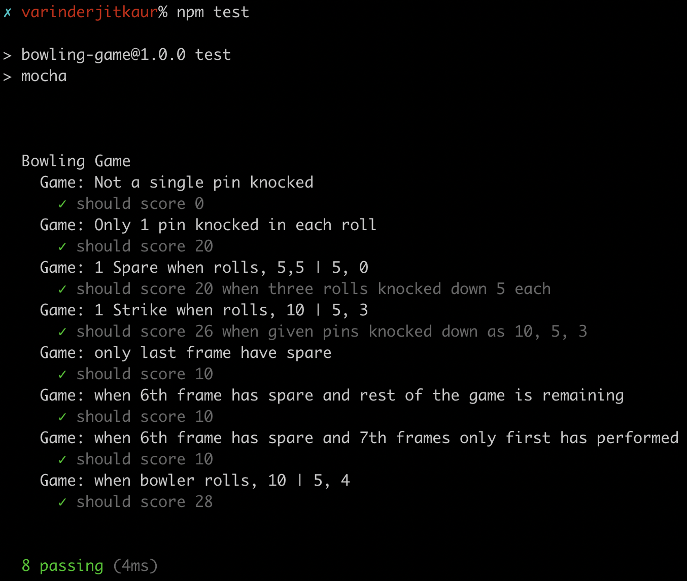

## Bowling Game
Calculates the total number of scores depending upon the number of pins knocked down in each roll. 

---
## Tech Used
JavaScript | Node.js (v15.5.1)

### Instructions to install Node.js
 - Download installer from https://nodejs.org/en/download/current/ to install on windows OS or MacOS.
 - Verify installation by entering `node -v` in the terminal.

---
## Installation
 - git clone https://github.com/vj-varinder/bowling-game.git
 - `cd bowling-game`
 - `npm install`
 - `npm test`

 ## To execute
 - `npm run dev`

---
## Features

The features on the system are:

* One player only
* In each frame, the bowler has 2 tries to knock down all the pins
* If in 2 tries, the bowler fails to knock down all the pins, their score is the sum of the number of pins they've knocked down in the 2 attempts

E.g, if a bowler rolls, 4,4

Their score is 8.  

* If in 2 tries, the bowler knocks down all the pins, it is a spare. The scoring of a spare is the sum of the number of pins knocked down plus the number of pins knocked down in the next bowl.

E.g, if a bowler rolls, 4,6 |  5, 0

Their score is 20. So that's (4 + 6 + 5) + (5 + 0)

* If in one try, the bowler knocks down all the pins, it is a strike. The scoring of a strike is the sum of the number of pins knocked down plus the number of pins knocked down in the next two bowls.

E.g, if a bowler rolls, 10 | 5, 4

Their score is 28. So that's (10 + 5 + 4) + ( 5 + 4)

* There are 10 pins in a frame
* There are 10 frames in a match
